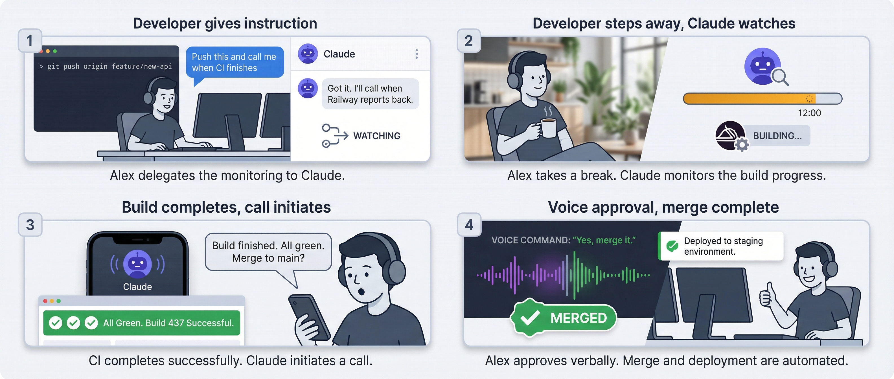
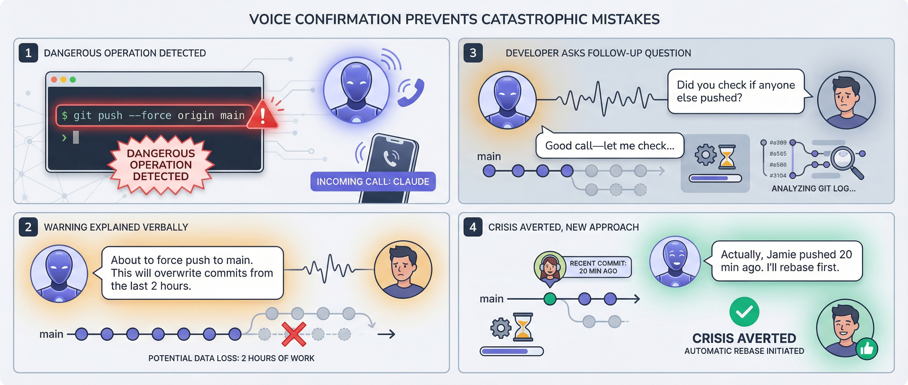

# Call-Me Cloud

[](LICENSE)
[](https://bun.sh)
[](https://railway.app/template/call-me-cloud)

**Voice conversations for AI agents.** Let Claude call you on the phone for real-time voice discussions - even when your laptop is off.

Built for the [Model Context Protocol (MCP)](https://modelcontextprotocol.io) - works with Claude Code, Claude Desktop, GitHub Actions, and any MCP-compatible client.

> **Note:** While Call-Me Cloud supports Docker and various hosting options, **the recommended path from the creator uses Railway + Twilio** for the smoothest setup experience.

## Prerequisites

Before setting up Call-Me Cloud, you'll need accounts with these services:

| Service | Purpose | Cost |
|---------|---------|------|
| **[Railway](https://railway.app)** | Cloud hosting for the call server | Free tier: $5/month credit |
| **[Twilio](https://twilio.com)** | Phone service provider | ~$1/mo phone + $0.014/min calls |
| **[Anthropic](https://console.anthropic.com)** | Claude API for GitHub Actions | Usage-based pricing |
| **[OpenAI](https://platform.openai.com)** | Text-to-speech and speech-to-text | ~$0.06/min for Realtime API |
| **[GitHub](https://github.com)** (optional) | For GitHub Actions integration | Free (2,000 Actions minutes/month for private repos) |

You'll also need to generate a secure API key (`CALLME_API_KEY`) - more on this in the configuration section.

## Features

- **Interrupt naturally** - Cut Claude off mid-sentence, just like a real conversation
- **Call from anywhere** - GitHub Actions integration means Claude can reach you even when your laptop is off
- **No tunneling headaches** - Cloud-native deployment to Railway or Render, no ngrok needed
- **Low-latency speech** - Streaming text-to-speech for responsive conversations
- **Production-ready security** - Webhook signature validation and token-based auth built in

## Architecture

```
┌─────────────────────────────────────────────────────────────────────────────┐
│                              Your Computer                                   │
│  ┌─────────────────┐                                                        │
│  │  Claude Code    │                                                        │
│  │  (MCP Client)   │────┐                                                   │
│  └─────────────────┘    │                                                   │
│           ▲             │ stdio                                             │
│           │             ▼                                                   │
│  ┌─────────────────┐                                                        │
│  │  MCP Server     │ (local)                                                │
│  │  mcp-client/    │                                                        │
│  └────────┬────────┘                                                        │
└───────────┼─────────────────────────────────────────────────────────────────┘
            │ HTTPS (REST API)
            ▼
┌─────────────────────────────────────────────────────────────────────────────┐
│                         Cloud (Railway / Render)                            │
│  ┌─────────────────────────────────────────────────────────────────────┐   │
│  │                      call-me-cloud server                            │   │
│  │  ┌──────────┐  ┌──────────┐  ┌──────────┐  ┌──────────────────┐    │   │
│  │  │ REST API │  │ Webhook  │  │WebSocket │  │ Audio Processing │    │   │
│  │  │ Handler  │  │ Handler  │  │ Server   │  │ (resample/encode)│    │   │
│  │  └──────────┘  └──────────┘  └──────────┘  └──────────────────┘    │   │
│  └─────────────────────────────────────────────────────────────────────┘   │
└───────────┬─────────────────────────────────┬───────────────────────────────┘
            │                                 │
            ▼                                 ▼
     ┌─────────────┐                  ┌─────────────┐
     │   Twilio    │                  │   OpenAI    │
     │             │                  │  TTS / STT  │
     │             │                  │  Realtime   │
     └──────┬──────┘                  └─────────────┘
            │
            ▼
     ┌─────────────┐
     │ Your Phone  │
     │   📱        │
     └─────────────┘
```

## Use Cases

Real-world scenarios where voice communication shines over text.

<table>
<tr>
<td width="50%">

### 🏃 Build Watcher

You kick off a 15-minute CI build and go for a walk. Claude monitors the build and calls you when it finishes.

**Claude:** "Hey, the deployment completed successfully. Everything's green. Want me to merge to main?"



</td>
<td width="50%">

### ⚠️ Dangerous Operation Approval

Claude needs to force push to main after a complex rebase.

**Claude:** "I'm about to force push to main. This will overwrite commits from the last 2 hours. Should I proceed?"

**You:** "Wait, did anyone else push?"

Voice confirmation prevents catastrophic mistakes.



</td>
</tr>
</table>

**More scenarios:** See [docs/USE-CASES.md](docs/USE-CASES.md) for 10 detailed storyboards including:
- **Missed Call Recovery** - Seamless voice-to-SMS continuity when you don't answer
- **Driving Developer** - Productive commute time with hands-free conversations
- **Accessibility-First** - Voice-first coding for developers with RSI
- **Late Night Alert** - Minimal disruption for urgent production issues
- And more...

## Quick Start

Choose your path:
- **[GitHub Actions](#quick-start-github-actions)** (Recommended) - Simpler setup, works anywhere, even when laptop is off
- **[Local MCP](#quick-start-local-mcp)** - For quick calls when you're near your laptop

### Quick Start: GitHub Actions

This is the easiest way to get started. Your laptop can be closed, you can be on a run - Claude calls you from the cloud.

**Prerequisites:**
1. A Railway deployment with Twilio configured (see [Deploy to Railway](#1-deploy-to-railway))
2. A GitHub repository
3. API keys: Anthropic, OpenAI, and your Call-Me Cloud API key

**Setup:**

1. **Copy the workflow file** to your repo:
   ```bash
   mkdir -p .github/workflows
   curl -o .github/workflows/call.yml https://raw.githubusercontent.com/riverscornelson/call-me-cloud/main/.github/workflows/call.yml
   ```

2. **Add GitHub Secrets** (Settings → Secrets and variables → Actions → New repository secret):
   - `ANTHROPIC_API_KEY` - Your Anthropic API key for Claude
   - `CALLME_API_KEY` - Your Call-Me Cloud API key (same as your Railway deployment)
   - `CALLME_CLOUD_URL` - Your Railway deployment URL (e.g., `https://your-app.railway.app`)

3. **Trigger a call** (two ways):

   **Option A: From a Local Claude Session (Programmatic)**

   If you're in a Claude Code session with repo access, use the GitHub CLI:
   ```bash
   # Immediate call
   gh workflow run call.yml -f prompt="Quick standup - what did I work on today?"

   # Scheduled call (5 minutes from now)
   gh workflow run call.yml -f delay_minutes=5 -f prompt="Review the API changes"

   # Call with custom branch for commits
   gh workflow run call.yml -f prompt="Refactor auth module" -f branch="feat/auth-refactor"
   ```

   **Option B: Manual Trigger via GitHub UI**

   Navigate to your repository on GitHub (desktop or mobile):
   1. Go to **Actions** tab
   2. Select **Call** workflow from the left sidebar
   3. Click **"Run workflow"** button
   4. Fill in the prompt, delay, and branch fields
   5. Click **"Run workflow"** to trigger

   This is useful when you're away from your laptop or want to trigger a call without opening a Claude session.

**How it works:**
- Claude runs in GitHub Actions with full repo access
- Calls you via your Railway deployment
- Can make commits during the conversation
- Pushes changes to the specified branch (or auto-generated branch)

**Example use:**
```bash
# From a local Claude session before going on a run
gh workflow run call.yml \
  -f delay_minutes=10 \
  -f prompt="I'm going for a 30-minute run. Call me to discuss the API design and any questions you have"
```

Claude calls you 10 minutes later while you're running, discusses the API, and commits any agreed-upon changes.

---

### Quick Start: Local MCP

Use this approach if you want Claude to call you from your local Claude Code or Claude Desktop sessions.

#### 1. Deploy to Railway

[](https://railway.app/new/template?template=https://github.com/riverscornelson/call-me-cloud)

Or manually:
1. Fork this repo
2. Connect to [Railway](https://railway.app)
3. Add environment variables (see [Configuration](#configuration))

#### 2. Configure Twilio

> **Note:** Phone provider setup takes ~1 hour. You'll be switching between portals and copying credentials back and forth. It's not hard, just fiddly.

1. Get a phone number from [Twilio Console](https://console.twilio.com)
2. Set webhook URL to `https://YOUR-RAILWAY-URL/twiml` (POST)

#### 3. Install MCP Client

```bash
cd mcp-client
bun install
```

#### 4. Add to Claude Code

```bash
claude mcp add call-me -- bun run /path/to/call-me-cloud/mcp-client/index.ts
```

Set environment variables in your Claude config (`~/.claude.json`):

```json
{
  "mcpServers": {
    "call-me": {
      "command": "bun",
      "args": ["run", "/path/to/call-me-cloud/mcp-client/index.ts"],
      "env": {
        "CALLME_CLOUD_URL": "https://your-app.railway.app",
        "CALLME_API_KEY": "your-secret-api-key"
      }
    }
  }
}
```

#### 5. Test It

```
You: Call me to discuss the project status
Claude: [Initiates phone call]
```

## Configuration

### Cloud Server Environment Variables

| Variable | Required | Default | Description |
|----------|----------|---------|-------------|
| `CALLME_API_KEY` | Yes | - | Secret key for API authentication (you generate this - see note below) |
| `CALLME_PHONE_ACCOUNT_SID` | Yes | - | Twilio Account SID |
| `CALLME_PHONE_AUTH_TOKEN` | Yes | - | Twilio Auth Token |
| `CALLME_PHONE_NUMBER` | Yes | - | Your Twilio phone number (format: +1XXXYYYZZZZ) |
| `CALLME_USER_PHONE_NUMBER` | Yes | - | Your personal phone number to receive calls (format: +1XXXYYYZZZZ) |
| `CALLME_OPENAI_API_KEY` | Yes | - | OpenAI API key for TTS/STT (Realtime API) |
| `CALLME_TTS_VOICE` | No | `onyx` | TTS voice (see [Voices](#available-voices)) |
| `OPENAI_API_BASE_URL` | No | - | Regional OpenAI endpoint (e.g., `us.api.openai.com`) |

> **Generating `CALLME_API_KEY`:** This is a secret you create yourself to secure communication between your MCP client and cloud server. Generate a secure random string (32+ characters) using:
> ```bash
> openssl rand -base64 32
> ```
> Use the same key in both your Railway deployment and your MCP client configuration.

### MCP Client Environment Variables

| Variable | Required | Description |
|----------|----------|-------------|
| `CALLME_CLOUD_URL` | Yes | Your Railway/Render deployment URL |
| `CALLME_API_KEY` | Yes | Same API key as cloud server |

### Available Voices

OpenAI TTS voices: `alloy`, `ash`, `ballad`, `coral`, `echo`, `fable`, `nova`, `onyx`, `sage`, `shimmer`, `verse`

## API Reference

All endpoints require `Authorization: Bearer <API_KEY>` header.

### Initiate Call
```http
POST /api/call
Content-Type: application/json

{"message": "Hey, I wanted to discuss the project status."}
```

**Response:**
```json
{
  "callId": "call-1-1234567890",
  "response": "User's spoken response",
  "interrupted": false
}
```

### Continue Conversation
```http
POST /api/call/:callId/continue
Content-Type: application/json

{"message": "What about the timeline?"}
```

### Speak Without Waiting
```http
POST /api/call/:callId/speak
Content-Type: application/json

{"message": "Let me explain..."}
```

### End Call
```http
POST /api/call/:callId/end
Content-Type: application/json

{"message": "Thanks, talk to you later!"}
```

**Response:**
```json
{"durationSeconds": 45}
```

### Health Check
```http
GET /health
```

## MCP Tools

When used with Claude Code or other MCP clients:

| Tool | Description |
|------|-------------|
| `initiate_call` | Start a new phone call with an initial message |
| `continue_call` | Send a follow-up message and wait for response |
| `speak_to_user` | Speak without waiting for a response |
| `end_call` | End the call with a closing message |

## Costs

| Service | Approximate Cost |
|---------|------------------|
| Railway | Free tier: $5/month credit |
| Twilio | ~$1/mo phone + $0.014/min outbound |
| OpenAI TTS | ~$15/1M characters |
| OpenAI Realtime STT | ~$0.06/min |

**Typical 1-minute call:** ~$0.05-0.08

## Self-Hosting with Docker

> **Note:** Docker support is a work in progress. The basics should work, but this hasn't been thoroughly tested yet. Contributions welcome!

```bash
docker build -t call-me-cloud .
docker run -p 3333:3333 --env-file .env call-me-cloud
```

Or with docker-compose:

```bash
docker-compose up
```

## Troubleshooting

### "Could not reach cloud server"
- Verify `CALLME_CLOUD_URL` includes `https://`
- Check Railway deployment is running
- Ensure `CALLME_API_KEY` matches on both client and server

### Call connects but no audio
- Verify OpenAI API key has Realtime API access
- Check Railway logs for WebSocket connection errors
- Ensure `CALLME_TTS_VOICE` is a valid voice name

### Twilio webhook errors
- Webhook URL must be `https://YOUR-URL/twiml` (not `/api/call`)
- Check Twilio Console for webhook delivery logs
- Verify `CALLME_PHONE_AUTH_TOKEN` is correct

### Call cuts off early
- Check Railway resource limits (memory/CPU)
- Increase `CALLME_TRANSCRIPT_TIMEOUT_MS` for longer responses

## Security

- **API Authentication**: Bearer token required for all API endpoints
- **Webhook Validation**: Twilio HMAC-SHA1 signatures verified
- **WebSocket Auth**: Cryptographically secure tokens with timing-safe comparison
- **No CORS**: Server-to-server only; browser access intentionally disabled

See [CLAUDE.md](CLAUDE.md) for security implementation details.

## Limitations

- **Outbound calls only** - Claude calls you; you cannot call Claude. This is intentional for security reasons: allowing inbound calls to wake up a terminal session with elevated permissions would be dangerous when you can't actively monitor it.
- **Miss the call, miss the conversation** - If you don't answer, the conversation stops. There's no voicemail or retry. Use `claude --resume` when you're back at your laptop to continue.

## Use Cases

See [docs/USE-CASES.md](docs/USE-CASES.md) for 10 detailed storyboards showing when voice communication adds value:

- **Missed Call Recovery** - Seamless voice-to-SMS continuity
- **Build Watcher** - "Call me when CI finishes"
- **Dangerous Operation Approval** - Voice confirmation before `git push --force`
- **Driving Developer** - Productive commute time
- **Accessibility-First** - Voice-first coding for RSI
- And 5 more...

## Roadmap

### ✅ GitHub Actions Integration (Shipped!)

**Status:** Launched January 2026

Claude can now call you from GitHub Actions workflows, even when your laptop is off. Supports scheduled calls, delayed calls, and full conversation-driven commits.

See the [GitHub Actions Quick Start](#quick-start-github-actions) for setup instructions.

**Key features:**
- Manual trigger with custom prompts
- Scheduled runs (e.g., daily standup at 9 AM)
- Delayed calls (wait N minutes before calling)
- Auto-generated or custom branch names for commits
- Full Claude Code capabilities in CI/CD

---

### 🔄 SMS Fallback (In Progress - Blocked on Twilio Approval)

When calls go unanswered, automatically fall back to SMS and continue the conversation via text.

| Aspect | Behavior |
|--------|----------|
| Trigger | After configurable timeout (`CALLME_SMS_TIMEOUT_SECONDS` env var) |
| Conversation | Full text conversation until user says "call me" |
| Detection | Fuzzy matching ("call me", "can you call", "let's talk", "phone me") |
| Rate limiting | None |

**Flow:**
1. Call initiates, rings for configured timeout
2. No answer → SMS sent with the original message
3. User can reply via text indefinitely
4. User texts "call me" (or similar) → Claude calls back
5. 7-minute inactivity → session closes (resume with `claude --resume`)

**Status:** Feature development complete. Waiting on Twilio A2P 10DLC approval to enable SMS in production test environment.

See [DESIGN-sms-fallback.md](DESIGN-sms-fallback.md) for technical details.

## Contributing

1. Fork the repository
2. Create a feature branch
3. Make your changes
4. Submit a pull request

## License

MIT License - see [LICENSE](LICENSE)

## Acknowledgments

- Built with [Bun](https://bun.sh) for fast TypeScript execution
- Phone services by [Twilio](https://twilio.com)
- Speech services by [OpenAI](https://openai.com)
- Designed for the [Model Context Protocol](https://modelcontextprotocol.io)
